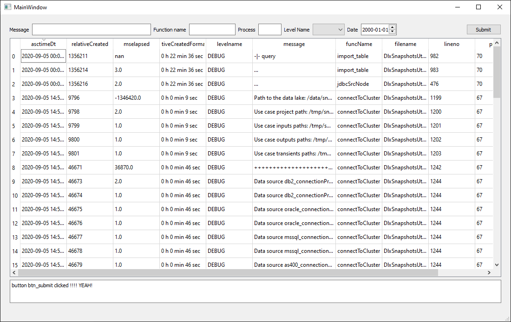

# pyqt-experiment

This is just a test using Python and QT and the QT designer.

This test project is a JSON logs viewer GUI for Windows and Mac using PyQT and some common Python libs (Pandas, ...)



I just want to test the performance of QT with python vs a web app. 
And also see if it is worth it in term of development speed. As the GUI can be built using
the Qt designer which is a WYSIWYG GUI using widget drag and drop (yup, this is way faster than HTML/CSS/JS and all these crapy techs I've had to use for the past 25 years :) ).

We will see how it goes... If I get to a point where the project could be useful (as a JSON viewer), I will improve the docs ...


## Instalation

```
pip install -r requirements.txt
```

